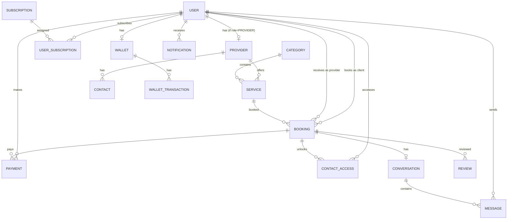

# Bolo-Man Data Model

## Entity Relationship Overview

## Key Design Decisions

1. **Currency as integers (XAF)**: No decimal, amounts stored in smallest unit
2. **PostGIS for geospatial**: Provider/service search by distance
3. **JSONB for features/flexibility**: Subscription features, availability schedules
4. **Country code scoping**: All multi-tenant queries filtered by `country_code`
5. **Soft deletes**: `isActive` flag rather than hard deletion

## Subscription Feature Flags

Each subscription tier has a JSON `features` blob:

| Feature | Classic | Gold | Premium |
|---------|---------|------|---------|
| contact_access | false | true | true |
| max_bookmarks | 5 | 20 | unlimited |
| max_concurrent_bookings | 2 | 5 | unlimited |
| priority_support | false | false | true |
| analytics_access | false | true | true |
| listing_boost (provider) | 0 | 1 | 3 |
| platform_fee_percent | 15% | 10% | 5% |

## Pricing in XAF (Cameroon)

| Tier | Client | Provider |
|------|--------|----------|
| Classic | 2,000/mo | 3,000/mo |
| Gold | 5,000/mo | 8,000/mo |
| Premium | 10,000/mo | 15,000/mo |

Micro-payment contact unlock: 500 XAF for 48 hours.
